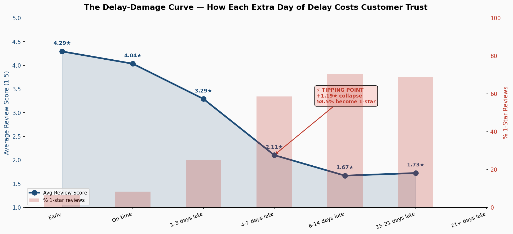

# Olist Trust Gap Model

Predicting a customer's review score (1 to 5 stars) before the review is written, using how late or early the order arrived, how reliable the seller has been, and basic order details.

Course project for DSAI 4103 Business Analytics. Author: Maryam Mahaboob.

## Business problem

At checkout, Olist (a Brazilian e-commerce marketplace) promises a delivery date. When that promise is broken, customers leave bad reviews. The question for this project: using only information available once the order is delivered, can we predict the review score before the customer writes it? That would let the business reach out to likely unhappy customers early.

The main inputs are:

- **Trust gap**: actual delivery date minus promised delivery date, in days (negative means early)
- **Seller reliability**: the seller's past average score, late rate, average trust gap and order volume
- **Order features**: price, freight, item count, product size and weight, payment type and installments, and whether the seller and customer are in the same state

## Data

- Source: [Olist Brazilian E-Commerce dataset on Kaggle](https://www.kaggle.com/datasets/olistbr/brazilian-ecommerce), 9 tables. See [data/README.md](data/README.md). Raw data is not included in this repo.
- 96,478 delivered orders; 95,808 remain after joining reviews and cleaning, and those are modelled.
- Orders from Oct 2016 to Aug 2018.
- Time-based 80/20 split on purchase date: 76,646 training orders (up to about 27 May 2018) and 19,162 test orders (after that).

## Approach

1. **Joins and cleaning.** Joined orders, reviews, items, payments, customers, products, sellers and category translations into one row per order. Kept delivered orders only, removed duplicate reviews, dropped orders with no review, filled 16 missing product sizes with the median, capped extreme trust gap and delivery-time values, and set negative shipping lags to 0.
2. **Feature engineering.** Trust gap, actual and promised delivery days, approval and shipping lag, freight ratio, same-state flag, four seller reliability features built from training orders, state and category target encodings (average review score, from training orders), and payment type dummies. 25 features in total.
3. **Model selection.** FLAML AutoML on a 15,000-order training sample (180 seconds, macro F1) picked XGBoost.
4. **Final model.** XGBoost classifier with balanced class weights, so the rare 1 to 3 star classes count as much as 5 stars.
5. **Explainability.** SHAP values on 2,000 test orders.
6. **Fairness check.** Macro F1 by customer state and by product category, plus a reweighting experiment for the weakest groups.

## Results

All numbers are from the notebook's saved outputs on the 19,162 test orders.

| Metric | Model | Baseline: always predict 5 stars |
|---|---|---|
| Macro F1 | **0.2581** | 0.1569 |
| Accuracy | 0.4236 | 0.6455 |
| Weighted F1 | 0.4580 | |
| ROC-AUC (macro, one-vs-rest) | 0.5893 | |
| Cohen's kappa | 0.0793 | |

Accuracy is below the 64.6% you would get by always predicting 5 stars, because the model is weighted to find unhappy customers (macro F1), not to maximise accuracy.

| Class | F1 | Test orders |
|---|---|---|
| 1 star | 0.2893 | 1,369 |
| 2 stars | 0.0606 | 484 |
| 3 stars | 0.1057 | 1,324 |
| 4 stars | 0.2419 | 3,615 |
| 5 stars | 0.5931 | 12,370 |

Training macro F1 was 0.3618, so there is a gap between training and test performance.

## Key findings



- **Most orders arrive early.** 92.0% of modelled orders arrived before the promised date and 6.7% arrived late. On average the promise had 11.5 days of slack.
- **Being late drives scores down fast.** Average review score by delivery timing: early 4.29, on time 4.04, 1 to 3 days late 3.29, 4 to 7 days late 2.11, 8 to 14 days late 1.67. At 8 to 14 days late, 70.6% of reviews are 1 star.
- **Delivery timing correlates most strongly with the score.** Correlation with review score: actual delivery days -0.349, trust gap -0.276. Every other feature is weaker.
- **Same-state orders do better.** When seller and customer are in the same state, delivery takes 7.4 days on average (vs 14.4), 4.5% are late (vs 7.9%), and the average score is 4.26 (vs 4.10).
- **Bad months line up with late months.** The three lowest-scoring months were Nov 2017 (avg 3.99, 12.3% late), Feb 2018 (3.88, 14.0% late) and Mar 2018 (3.81, 18.7% late).
- **Some states and categories score lower.** MA (3.83) and AL (3.86) have the lowest average scores and the highest late rates (17.2% and 20.8%). SP is highest at 4.25. Among categories with 100+ orders, office_furniture is lowest (3.65) and books_general_interest is highest (4.54).
- **Seller history and delivery timing dominate the model.** Top 5 features by mean SHAP value: seller_avg_score (0.1555), trust_gap_days (0.1089), item_count (0.0691), actual_delivery_days (0.0611), seller_order_volume (0.0548). The importance of seller_avg_score is likely inflated by the in-sample encoding described under Known limitations.
- **Fairness.** 3 of the 24 states with 30+ test orders score more than 0.05 below the overall macro F1: TO (0.1235, 55 orders), RO (0.1790, 37 orders) and SE (0.1907, 76 orders). So do 8 of 41 categories. Upweighting those groups lowered overall macro F1 slightly (0.2571) and widened the gap between the best and worst state (0.1657 to 0.2310), so the original model was kept.

## Known limitations

- **In-sample encoding.** On training rows, the seller, state and category averages include that row's own review score. For a seller with only one training order, seller_avg_score equals the label. Test rows only use training data, but this makes training look easier than it is.
- **Early stopping used the test set.** XGBoost picked its number of trees by watching the test set, so the reported test scores are slightly optimistic.
- **Model file mismatch.** `model_package/xgb_final_model.json` and `model_metadata.json` come from a later run than the notebook's saved outputs (best iteration 68 vs 53; macro F1 0.2601 vs 0.2581). The tables above use the notebook's saved outputs.
- **2-star reviews are hard to predict.** F1 is about 0.06. There is little in the data that separates 2 stars from 1 and 3 stars.
- **Fairness gaps.** Small states and some categories score well below average, and reweighting did not fix it.
- **Older data.** The data covers 2016 to 2018 only.

**v2 planned:** use a time-ordered validation set for early stopping, build seller, state and category averages from earlier orders only, and regenerate the model files from a single run.

## Dashboard


Interactive Power BI file: dashboard/OlistTrustGap.pbix

## Presentation

- Slides (PDF): [presentation/OlistTrustGap_Slides.pdf](presentation/OlistTrustGap_Slides.pdf)
- View-only Canva version: https://canva.link/myjxoxcfv5n6r2q

## Repo structure

```
.
├── README.md
├── requirements.txt
├── .gitignore
├── notebooks/
│   └── olist_trust_gap.ipynb    full analysis: cleaning, EDA, model, SHAP, fairness
├── model_package/
│   ├── xgb_final_model.json     trained XGBoost model
│   ├── model_metadata.json      feature list, metrics, limitations
│   ├── encoding_maps.json       state and category encodings from training data
│   └── score.py                 scores a single order
├── figures/                     EDA plots saved by the notebook
├── dashboard/
│   └── screenshots/             Power BI screenshots
├── presentation/                slide PDF
└── data/
    └── README.md                where to get the raw data
```

## How to run

The notebook was built for Google Colab with the data on Google Drive.

1. Download the 9 CSV files listed in [data/README.md](data/README.md).
2. In Google Drive, create the folder `MyDrive/olist_project/` and put all 9 CSV files in it. The notebook reads from `/content/drive/MyDrive/olist_project/`.
3. Open `notebooks/olist_trust_gap.ipynb` in Colab.
4. Run the first cell (`!pip install flaml --quiet`), then mount Drive when asked.
5. Run all cells in order. FLAML AutoML takes about 3 minutes.

The notebook writes its outputs back to `MyDrive/olist_project/`: `master_clean.csv`, the EDA plots in `eda_plots/`, the evaluation and SHAP plots, `model_package/`, and the `powerbi_*.csv` files used by the dashboard.

To score a single order with the saved model:

```
pip install -r requirements.txt
python model_package/score.py
```

`score.py` runs two example orders. To score your own order, call `predict_score()` with a dict of order features. You need to supply the four seller features yourself.

## Requirements

Python 3 with pandas, numpy, xgboost, flaml, shap, scikit-learn, matplotlib and seaborn (see [requirements.txt](requirements.txt)). In Colab only flaml needs installing; the rest are already available.
